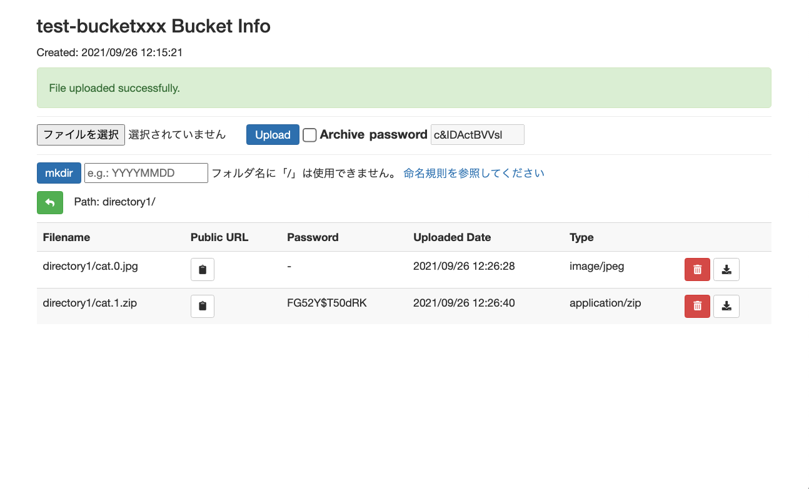

# Flask S3 Browser

Simple operation of AWS S3 from a web browser



## What you can do

- File upload(ACL='public-read') / download / delete
- Creating a directory
- Zip archive on upload (with password)
- Getting the Public URL
- Display password when uploading archives from (this tool)
- Expiration by Lifecycle
- Select Encoding (UTF-8, Shift_JIS(CP932))
- Compression support for multi-byte filenames
- Support for more encrypted uploads for zip files

## Setup

Flask S3 Browser supports 3.10.x <= Python <> 3.13.x

- Install Dependencies

```sh
poetry config --local virtualenvs.in-project true
poetry install
poetry shell
pip install -r requirements.txt
```

- Configuration

Create a new file `.env` using the contents of `.env-sample.` If you are not using the AWS CLI, modify the placeholders to add your AWS credentials and bucket name.

## Usage

```sh
# local
gunicorn -c config.py --workers=4 app:app
# docker
docker compose up -d
```

## Test

```sh
# Unit test
pytest --config-file=tests/UT/unit.toml
# Integration test
pytest --config-file=tests/IT/integration.toml
```

## Clone origin

<https://github.com/kishstats/flask-s3-browser>
