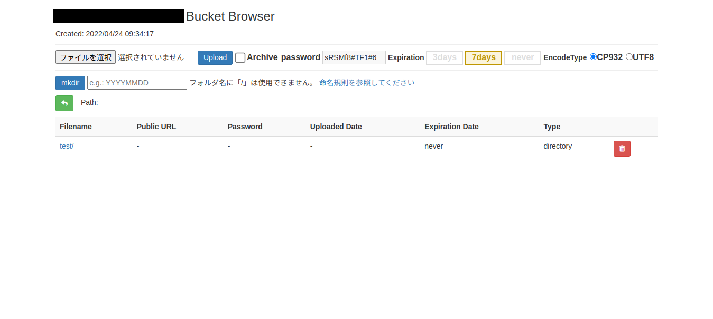

# Flask S3 Browser

Simple operation of AWS S3 from a web browser



## What you can do

- File upload(ACL='public-read') / download / delete
- Creating a directory
- Zip archive on upload (with password)
- Getting the Public URL
- Display password when uploading archives from (this tool)

## Setup

Flask S3 Browser supports Python >= 3.9.x

- Install Dependencies

```sh
pip install -r requirements.txt  # pip
conda env create -f M1Mac_miniconda_env.yaml  # Apple M1 Mac miniconda
```

- Configuration

Create a new file `.env` using the contents of `.env-sample.` If you are not using the AWS CLI, modify the placeholders to add your AWS credentials and bucket name.

## Usage

```sh
flask run
```

## Clone origin

<https://github.com/kishstats/flask-s3-browser>
